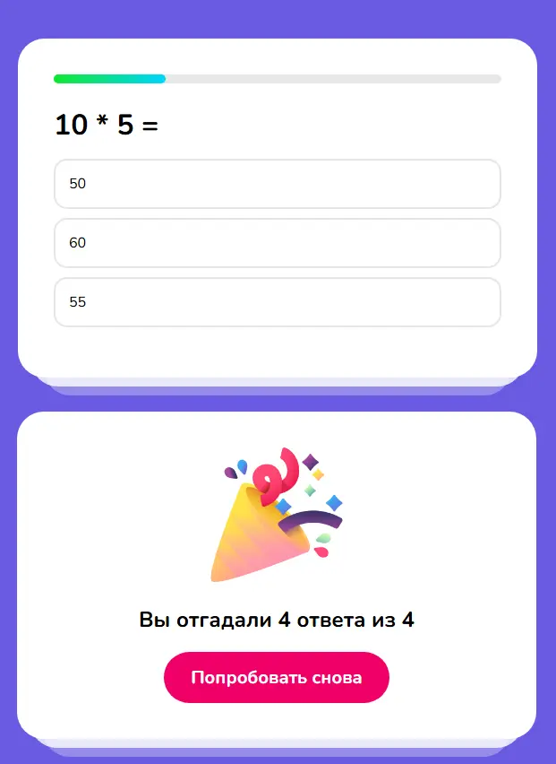

# reactQuiz

 

    
    

 

Простое приложение-викторина на React.

## Технологии и библиотеки

- **React** 
- **Create React App** 
- **Sass**

## Структура проекта

- `src/App.js` — основной компонент приложения
- `src/index.js` — точка входа приложения
- `src/index.scss` — глобальные стили
- `public/index.html` — HTML-шаблон

## Скрипты

- `npm start` — запуск приложения в режиме разработки
- `npm run build` — сборка приложения для продакшена
- `npm test` — запуск тестов (если реализованы)
